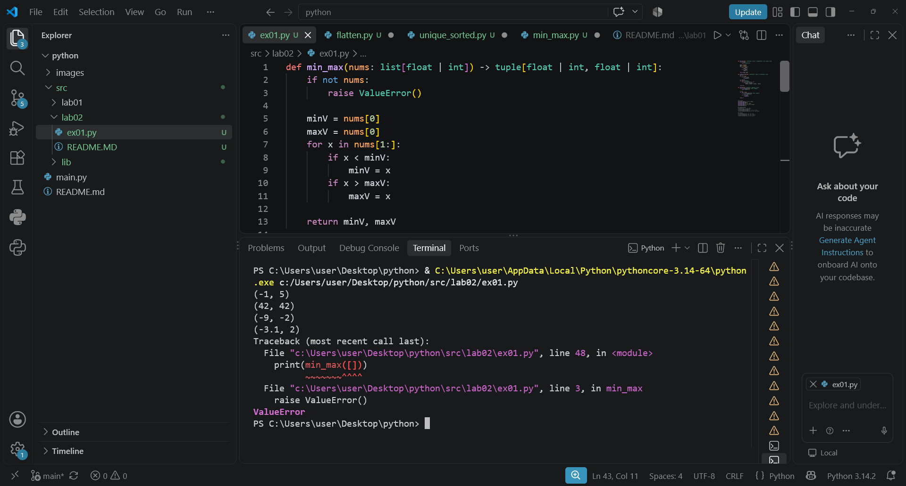
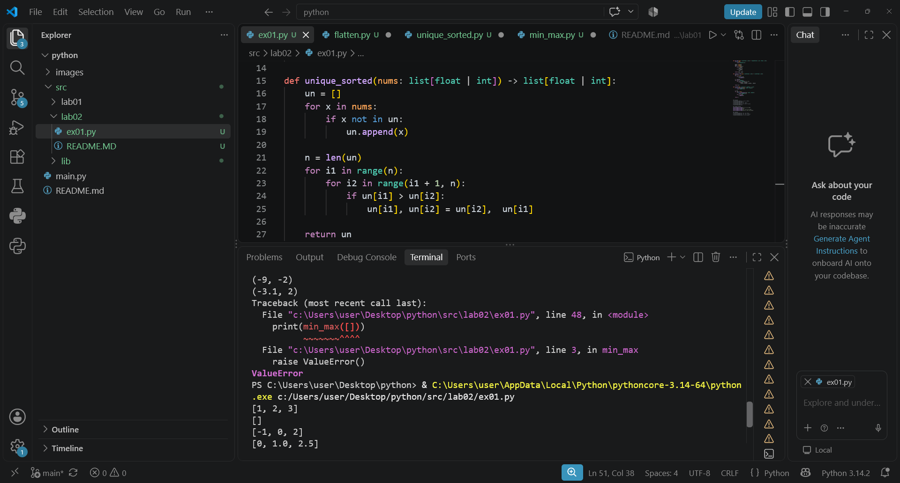
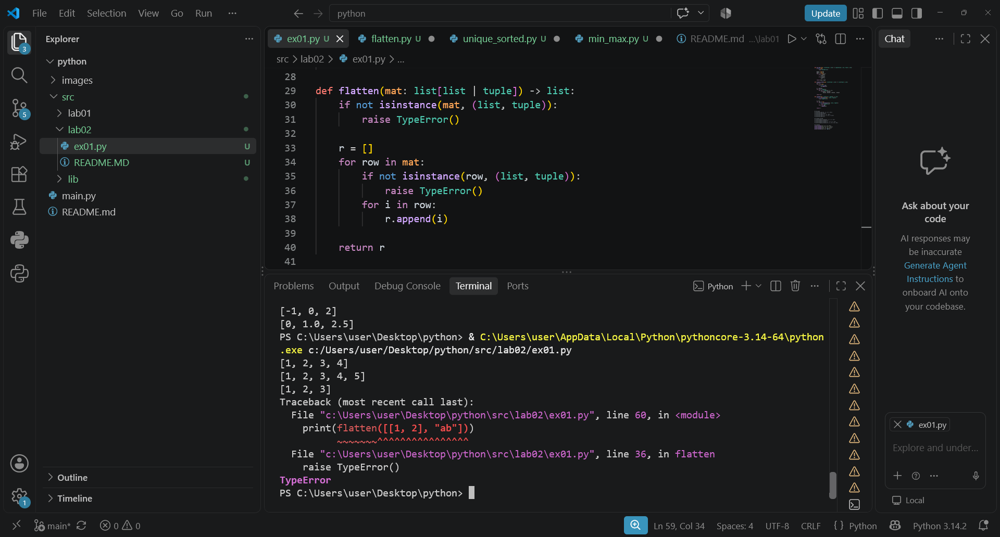
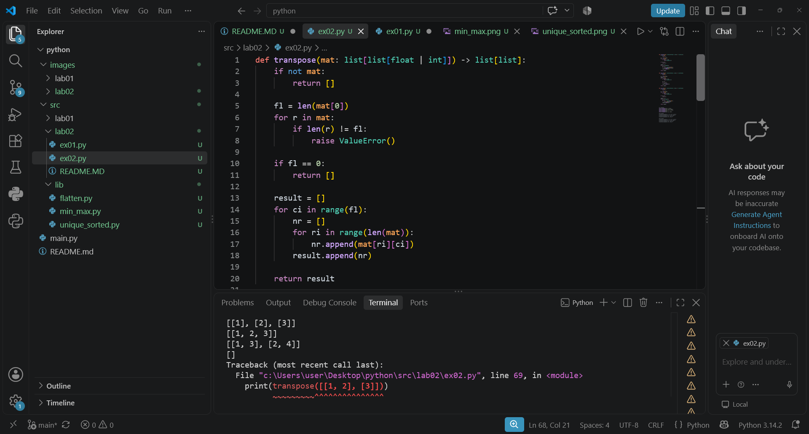
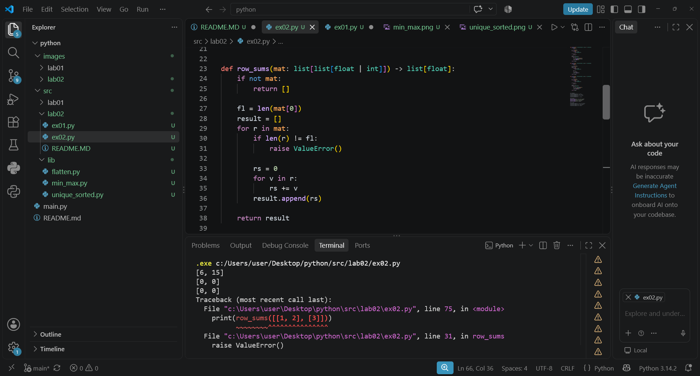
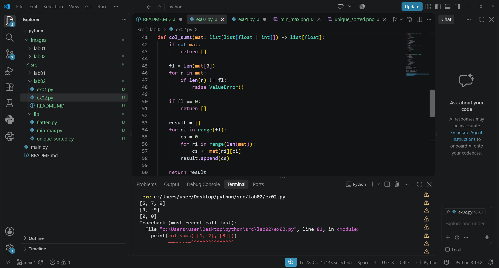
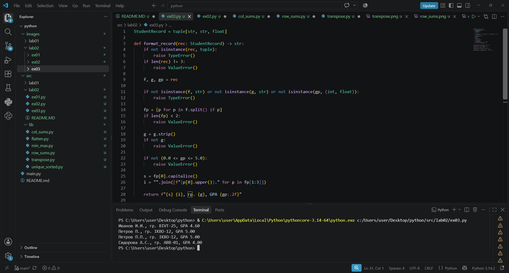

# УПРАЖНЕНИЕ 1

## ФУНКЦИЯ 1

Обьявляем данную функцию, делаем проверку на пустоту, если nums пустой выводим ошибку.Обозначаем временно минимальное и максимальное значение  как первый элемент в nums, перебираем весь nums и если x больше нынешнего максимального значения или меньше нынешнего минимального значения присваеваем его в minV или maxV, возвращаем minV и maxV, делаем проверку

## ФУНКЦИЯ 2

Обьявляем данную функцию, создаем пустой список для уникальных чисел, а также создаем цикл идущий по nums в котором присваеваем уникальные значений в ранее созданный список, считываем длину уникального списка, создаем двойной цикл, который идет по парам чисел до конца списка, если левое число в паре большего правого, то меняем местами, возвращаем уникальный сортированный список, делаем проверку

## ФУНКЦИЯ 3

Обьявляем данную функцию, проверяем, что в функции лежит список или картеж, иначе выводим ошибку, создаем пустой список, создаем цикл проходящий по каждй строке массива mat. Делаем проверку является ли текущая строка списком или картежем, иначе выводим ошибку, перебираем каждый отдельны1й элемент и складываем его в итоговый список

# УПРАЖНЕНИЕ 2

## ФУНКЦИЯ 1

Обьявляем данную функцию, проверяем на пустоту, проверяем матрицу на рваность, если матрица состоит из пустых списков возвращаем пустой список, создаем result и 2 цикла идущие по строкам и стобцам потом берем элемет из старой матрицы по координатом и кладем в новую строку, добавляем в result

## ФУНКЦИЯ 2

Обьявляем данную функцию, проверка на пустые и рваные матрицы, проходм по каждому числу в строке, складываем и выводим результат

## ФУНКЦИЯ 3

Обьявляем данную функцию, проверка на пустые и рваные матрицы, создаем цикл ci который выбирает столбец, обнуляем сумму перед следующим запуском, цикл ri идет сверху вниз по всем строкам и суммирует элементы через mat[ri][ci] добавляем сумму в result, выводим

# УПРАЖНЕНИЕ 3

Задаеь формат такой, что запись студента представляет собой картеж из трех элементов, обьявляем функцию, если rec не картеж, вывести ошибку задаем переменные из картежа, проверяем, что каждый элемент в картеже строчкой кроме GPA, разделяем строчку по пробелам и берем каждый элемент отдельно, если таких элементов в строке меньше 3 выводим ошибку, удаляем лишние пробелы из переменной отвечающую за группу, проверяем что GPA подходит по числовому значению,  берем каждое слово в ФИО и делаем первые буквы заглавные, а остальные строчныии, береи имя и отчество делаем заглавными и склеиваем через точку чтобы получились инициалы, выводим результат